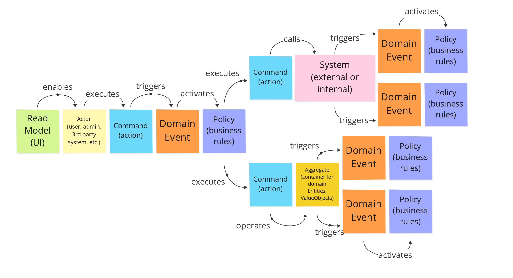
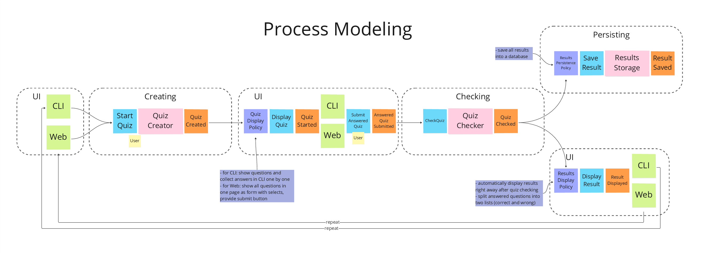
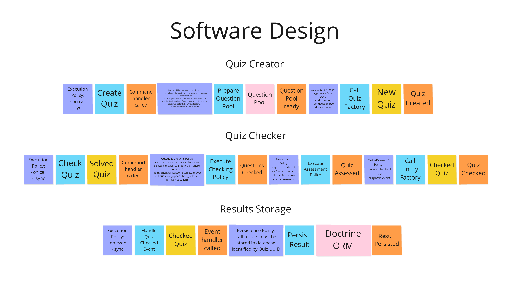

## Event Storming

### Basics

There is a lot of information about it on the Internet, but in a nutshell...

There are 3 types of [Event Storming](https://en.wikipedia.org/wiki/Event_storming) separated by purpose.

- **Big Picture**
    - exploration of an entire business flow, basically anyone from regular specialists to stakeholders is encouraged to participate
- **Process Modelling**
    - designing the specific business processes though collaboration of domain, technical and other experts
- **Software Design**
    - focusing on implementation details, mainly technical experts are engaged, may require some [proof of concept (POC)](https://en.wikipedia.org/wiki/Proof_of_concept) testing and experiments

There are following building blocks used to describe the processes (there are more, enumerating only those being used).

This flow can be described in plain English:

- A `Read Model` (some interface, UI or API) **enables** an `Actor` (user, client) to **execute** a `Command` (action) which **triggers** a `Domain Event`, that **activates** a `Policy` (some business rules), that **executes** other `Command(s)`.
- `Commands` may **call** some `Systems` (external or internal) and(or) **operate** domain `Aggregates` (Entities, etc.).
- The `Systems` and `Aggregates` may **trigger** other `Domain Events` that **activate** other domain `Policies` (business rules) and so on...

**_Note_**: a `Policy` can be omitted if it states something obvious, for example:
> When {SomeEvent} happens - **Always** execute {SomeCommand}

"Always" `Policy` can be omitted in this case, so that a `Domain Event` **executes** a `Command` (event handler/listener).

### Modeling Quiz System 

**Big Picture** was skipped in this project as it's inappropriate here - no big picture here, just "a simple" system to create and check quizzes.

